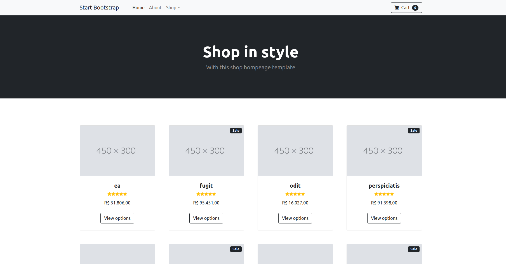
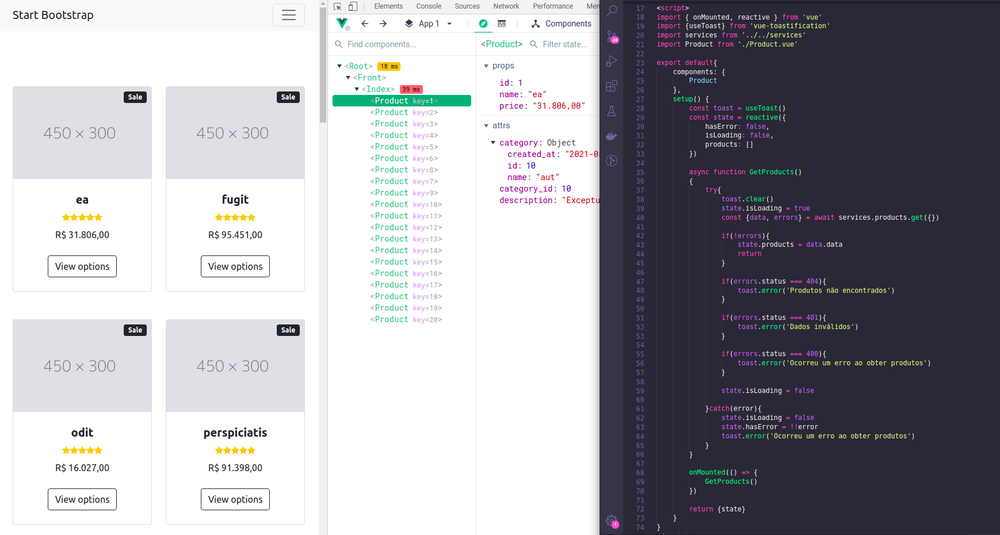
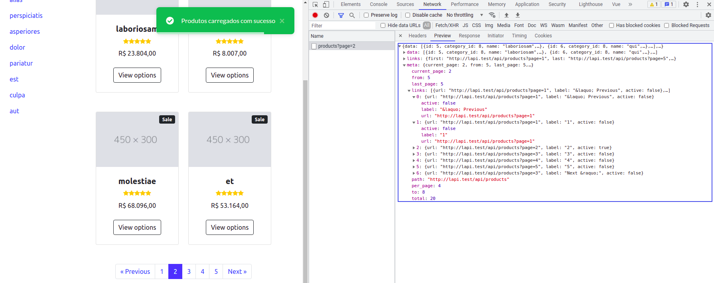

## About Laravel

Laravel is a web application framework with expressive, elegant syntax. We believe development must be an enjoyable and creative experience to be truly fulfilling. Laravel takes the pain out of development by easing common tasks used in many web projects, such as:

- [Simple, fast routing engine](https://laravel.com/docs/routing).
- [Powerful dependency injection container](https://laravel.com/docs/container).
- Multiple back-ends for [session](https://laravel.com/docs/session) and [cache](https://laravel.com/docs/cache) storage.
- Expressive, intuitive [database ORM](https://laravel.com/docs/eloquent).
- Database agnostic [schema migrations](https://laravel.com/docs/migrations).
- [Robust background job processing](https://laravel.com/docs/queues).
- [Real-time event broadcasting](https://laravel.com/docs/broadcasting).

Laravel is accessible, powerful, and provides tools required for large, robust applications.

## Learning Laravel

Laravel has the most extensive and thorough [documentation](https://laravel.com/docs) and video tutorial library of all modern web application frameworks, making it a breeze to get started with the framework.

If you don't feel like reading, [Laracasts](https://laracasts.com) can help. Laracasts contains over 1500 video tutorials on a range of topics including Laravel, modern PHP, unit testing, and JavaScript. Boost your skills by digging into our comprehensive video library.

## Laravel Sponsors

We would like to extend our thanks to the following sponsors for funding Laravel development. If you are interested in becoming a sponsor, please visit the Laravel [Patreon page](https://patreon.com/taylorotwell).

### Premium Partners

- **[Vehikl](https://vehikl.com/)**
- **[Tighten Co.](https://tighten.co)**
- **[Kirschbaum Development Group](https://kirschbaumdevelopment.com)**
- **[64 Robots](https://64robots.com)**
- **[Cubet Techno Labs](https://cubettech.com)**
- **[Cyber-Duck](https://cyber-duck.co.uk)**
- **[Many](https://www.many.co.uk)**
- **[Webdock, Fast VPS Hosting](https://www.webdock.io/en)**
- **[DevSquad](https://devsquad.com)**
- **[Curotec](https://www.curotec.com/services/technologies/laravel/)**
- **[OP.GG](https://op.gg)**
- **[CMS Max](https://www.cmsmax.com/)**
- **[WebReinvent](https://webreinvent.com/?utm_source=laravel&utm_medium=github&utm_campaign=patreon-sponsors)**

## Contributing

Thank you for considering contributing to the Laravel framework! The contribution guide can be found in the [Laravel documentation](https://laravel.com/docs/contributions).

## Code of Conduct

In order to ensure that the Laravel community is welcoming to all, please review and abide by the [Code of Conduct](https://laravel.com/docs/contributions#code-of-conduct).

## Security Vulnerabilities

If you discover a security vulnerability within Laravel, please send an e-mail to Taylor Otwell via [taylor@laravel.com](mailto:taylor@laravel.com). All security vulnerabilities will be promptly addressed.

## License

The Laravel framework is open-sourced software licensed under the [MIT license](https://opensource.org/licenses/MIT).

----

## Neste projeto

<b style="color: red; text-transform: uppercase;">Observação:</b> por se tratar apenas de um projeto com fins de estudos, não descreverei os processos utilizados com tanta criticidade. Dito isso, peço que leve em consideração a ocorrência de erros ortográficos em descrições, imagens com qualidade reduzida ou algum Bug que possa ocorrer.

## Do Blade ao Vue.js

A aplicação foi desenvolvida com um template simples de listagem utilizando o carregamento de view com <b>Blade</b>.

Tudo isso foi pensado e planejado para que após essa etapa, ocorra uma migração do carregamento para utilizar o consumo de produtos vindos de uma API e o exibí-los utilizando o <b>Vue.js</b>

## Exemplo de End Points já criados

- api/categories
- api/categories/{category}
- api/products
- api/products/{product}

## Vue.js, carregando produtos

Abaixo, veja como está a distribuição dos components de produtos após o consumo da API que retorna os dados para o carregamento em tela.

 
<strong>Ao seu sucesso,</strong>  João Paulo N Freitas

## Páginação de resultados

A integração do vue com a API do Laravel facilita muito o trabalho e trás uma produtividade sem comparações.

Quem já passou pela situação de criar uma páginação de resultados sabe o quanto é CHATO.

O **->paginate()** do Laravel, devolve um objeto completo e cabe a você apenas exibir em tela.

<b style="color: red;">[...Continua...]</b>
 
